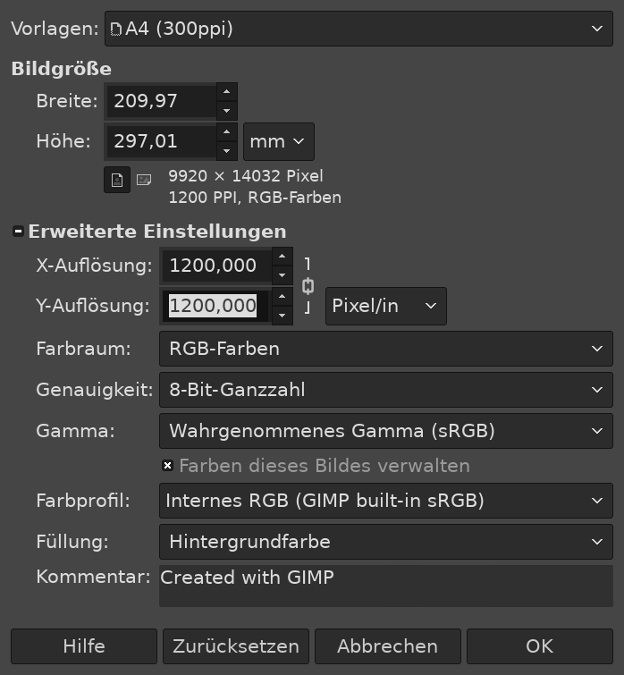
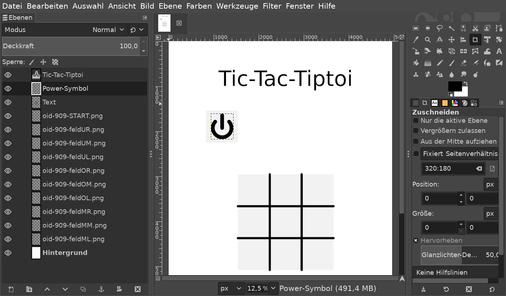

.. _erste_schritte:

Erste Schritte
==============

Dieses Kapitel erklärt dir Schritt für Schritt und an einfachen Beispielen, was du mit dem `tttool` anstellen kannst. Die Details werden dann vollständig in den nächsten Kapiteln erklärt.

Vorbereitung
------------

Auf der
`Release-Seite <https://github.com/entropia/tip-toi-reveng/releases>`_ findest du eine Zip-Datei, die du herunterlädst und entpackst. Du findest darin die Datei ``tttool.exe`` (für Windows) oder ``tttool`` (für Linux und OSX), die man direkt ausführen kann. Es ist keine weitere Installation nötig.

Allerdings ist zu beachten, dass es sich dabei um ein
Kommandozeilenprogramm handelt. Doppelt klicken bringt also nichts,
sondern du musst die Eingabeaufforderung starten, in das Verzeichnis mit
``tttool.exe`` wechseln und dann Befehle wie
``./tttool info WWW_Bauernhof.gme`` eintippen. Ein vorangestelltes ``$``
in folgenden Listings wird nicht mit eingegeben, sondern markiert die
Zeilen, die einzugeben sind. Wenn dir das neu ist, dann sei dir ein kleines
`Tutorial zur
Kommandozeile <http://www.owih.org/2012/03/04/xp-kommandozeile-teil-1/>`__
empfohlen.

Töne in Tiptoi-Büchern ändern
-----------------------------

Als erstes einfaches Projekt kannst du in einem deiner Tiptoi-Bücher ein paar Töne ändern. Überrasche dein Kind doch, indem du deine eigene Stimme ertönen lässt! Als Beispiel nehmen wir das Buch „Wieso? Weshalb? Warum? -- Bauernhof“, aber du kannst diese Anleitung auch mit einem anderen Buch verfolgen.

Zu jedem Tiptoi-Produkt gehört eine „GME-Datei“, die sowohl die Töne als auch die Programmlogik enthält -- in unserem Fall ``WWW_Bauernhof.gme``. Du findest sie auf dem Tiptoi-Stift selbst, oder auf der `Ravensburger Download-Seite <https://www.tiptoi.com/de/start/anleitung-haendischer-download/index.html>`_. Kopiere Sie in den Ordner mit dem ``tttool.exe``.

Führe nun die folgenden beiden Befehle aus:

.. code:: bash

  $ ./tttool export WWW_Bauernhof.gme
  $ ./tttool media WWW_Bauernhof.gme

Du solltest nun in diesem Verzeichnis eine Datei ``WWW_Bauernhof.yaml`` finden (die du  vorerst ignorierst), sowie ein Verzeichnis ``media/`` mit vielen Audio-Dateien im ``ogg``-Format finden. Hör einfach mal rein!

Damit bist du schon halb fertig. Suche die Audio-Datei, die du ersetzen willst und merke dir den Dateinamen -- zum Beispiel ``WWW_Bauernhof_3.ogg`` für die Frage „Was ist das besondere an dem Kuhstall“.  Du kannst die Datei ruhig löschen, denn du willst sie durch deine eigene Aufnahme ersetzen.

Zu erklären, wie du eine Audiodatei aufnimmst würde hier den Rahmen sprengen. Wichtig ist vor allem, dass du die Datei im OGG- oder MP3-Format aufnimmst. Speichere sie in dem ``audio``-Verzeichnis als ``WWW_Bauernhof_3.ogg``.

Nun musst du die GME-Datei wieder zusammenbauen:

.. code:: bash

  $ ./tttool assemble WWW_Bauernhof.yaml Mein_Bauernhof.gme

Nun solltest du in dem Verzeichnis die Datei ``Mein_Bauernhof.gme`` finden. Kopiere diese Datei auf den Tiptoi-Stift. Es darf immer nur eine GME-Datei pro Produkt auf dem Stift sein, also musst du die originale ``WWW_Bauernhof.gme`` löschen -- natürlich nur nachdem du eine Sicherheitskopie davon auf deinem Rechner erstellt hast.


Das war es schon! Wenn du nun den Stift einschaltest, den Bauernhof aktivierst und auf den Kuhstall tippst, solltest du deine eigene Stimme hören.

.. note:: Da wir das Dateiformat nicht vollständig verstanden haben, kann es sein, dass manche Elemente -- insbesondere Spiele -- nun nicht mehr funktionieren.

Eigene Tiptoi-Produkte herstellen
---------------------------------

Als nächstes wirst du ein komplett eigenes Tiptoi-Projekt herstellen. Als kleines Beispiel nehmen wir hier ein Tic-Tac-Toe-Spiel -- das braucht nur wenige aktive Bereiche und ist grafisch simpel, aber ziegt schon, wie du komplexere Abläufe programmierst.

Für ein Tiptoi-Produkt brauchst du zwei Komponenten:

 * die GME-Datei mit der Programmierung und den Audio-Dateien, und
 * das Buch (hier, das Blatt Papier) mit der Grafik und den Codes.

Bei beidem hilft das ``tttool``, und in beiden ist der Ausgangspunkt die sogenannte YAML-Datei.

Der erste Ton
~~~~~~~~~~~~~

Du beginnst also mit einer einfachen YAML-Datei. Öffne den Texteditor deiner Wahl, schreibe folgendes und speichere es as ``tic-tac-toe.yaml``:

.. code:: yaml

   product-id: 900
   comment: Tic-Tac-Toe fuer den Tiptoi
   scripts:
     feldOL: P(oben_links)


`YAML <https://de.wikipedia.org/wiki/YAML>`_ ist ein generisches Datenformat,
das du mit einem beliebigen Texteditor erstellen und bearbeiten kannst. Beachte
dabei dass in YAML Einrückungen, also Leerzeichen am Anfang der Zeile, wichtig
sind.

Die einzig wichtigen Felder sind ``product-id`` und ``scripts``. Die ``product-id``
ist eine Nummer, die dein Projekt indentifiziert, und mit der am Ende der Stift
die passende GME-Datei zu ausgewählten Buch findet. Das ``comment``-Feld hat
keine weitere Bedeutung. Wirklich spannend ist das ``scripts``-Feld: Hier wird
festgelegt, dass es ein Feld namens “``feldOl``” geben wird, und wenn der
Benutzer mit dem Stift drauf geht, soll die Audiodatei namens
``oben_links`` abgespielt werden.

Diese Audiodatei muss nun irgendwo herkommen. Du kannst sie selber aufnehmen
und als ``oben_links.ogg`` abspeichern, und am Ende wirst du das sicher machen
wollen. Aber gerade während du dein Tiptoi-Produkt noch entwickelst, oder für
schnelle Experimente, ist das sehr hinderlich.

Daher kann das ``tttool`` auch selbst die Ansagen erstellen, mittels
Text-To-Speech [#]_.  Füge dazu folgende Zeilen der Datei hinzu:


.. code:: yaml

   language: de
   speak:
     oben_links: "Du hast oben links hingetippt"

Damit ist die YAML-Datei schon brauchbar! Mit dem Befehl

.. code:: bash

   $ ./tttool assemble tic-tac-toi.yaml

wird dir eine Datei namens ``tic-tac-tiptoi.gme`` erstellt, die du auf den
Stift kopierst.

Nun brauchst du noch den zugehörigen Ausdruck mit den Punktmustern. Auch hier musst du dich noch nicht gleich an die fertige Gestaltung machen: Mit dem Befehl

.. code:: bash

   $ ./tttool oid-table tic-tac-toi.yaml

erstellt dir das ``tttool`` die Datei ``tic-tac-tiptoi.pdf``, die alle
Punktmuster für dein Werk in einer nüchternen, aber praktischen Tabelle
enthält. Du siehst dort neben dem Feld für ``feldOL`` auch eines mit der Beschriftung ``START``. Dies ist das Anschaltzeichen für dein Produkt.

Wenn du diese Datei nun ausdruckst, mit dem Stift auf das Anschaltzeichen gehst, und danach auf das andere Feld, solltest du eine Roboterstimme hören, die „Du hast oben links hingetippt.“ sagt.


.. note:: Das Drucken ist die hakeligste Sache an der ganzen Bastelei. Mit
   manchen Druckern klappt es auf Anhieb, mit anderen muss man lange mit den
   Druckeinstellungen herumspielen, oder die Punktmuster deutlich fetter
   auftragen, bei anderen ist gar nichts zu machen. Vielleicht hilft dir die
   `Seite zum Thema Drucken
   <https://github.com/entropia/tip-toi-reveng/wiki/Printing>`_ auf dem
   Tiptoi-Wiki weiter, wenn es nicht gleich klappt.

Spiellogik programmieren
~~~~~~~~~~~~~~~~~~~~~~~~

Nun füllst du das Spielfeld mit Leben. Dazu musst du dir, was sich das Programm „merken“ muss.

Für das Feld oben links müssen es sich zum Beispiel merken, ob es leer ist, von Spieler 1 (Kreuz) belegt oder von Spieler 2 (Kreis) belegt ist. Dazu verwendest du das Register ``$OL``, was entsprechend die Werte 0, 1 oder 2 speichert. Wir sprechen hier von Registern, aber man kann genau so gut Variablen oder Speicherplätze sagen.

Wenn ein Spieler nun ``feldOL`` antippt, und es ist schon belegt, so möchtest du ihn wissen lassen, was hier schon ist. Ist es allerdings frei, so musst du ``$OL`` entsprechend ändern. Dazu musst du natürlich natürlich wissen, wer dran ist! Das speicherst du im Register ``$turn``, mit den Werten 1 und 2.

Insgesamt hast du also drei Fälle, die du wie folgt aufschreibst:

.. code:: yaml

   scripts:
     feldOL:
     - $OL == 0? $OL := $turn J(here_now)
     - $OL == 1? P(here_cross) J(next)
     - $OL == 2? P(here_circle) J(next)


Wenn der Benutzer nun das Feld antippt, prüft der Stift die drei Zeilen der Reihe nach, und führt die erste aus, wo alle Bedingungen passen. Bedingungen erkennnst du an dem Fragezeigen: Hier prüfst du, welcher Wert in ``$OL`` gespeichert ist. Den ``P(…)``-Befehl kennst du schon, der gibt eine Audiodatei aus (und um die eigentlich Audiodateien kümmerst du dich später). Mit ``$OL := $turn`` wird die Nummer des aktuellen Spielers (laut ``$turn``) in das Feld geschreiben (``$OL``).

In allen drei Fällen willst du allerdings noch mehr machen: Wenn ein neues Feld belegt wurde, willst du den Stift das sagen lassen. Und wenn nicht, willst du zumindest sagen, wer nun dran ist. Da das bei allen Feldern der gleiche Code sein wird, programmierst du ihn im Folgenden nur einmal, und springst den Code mit dem ``J``-Befehl (für „Jump“) an.

Um zum Beispiel zu verkünden, wer eigentlich gerade dran ist, füge das folgende Skript hinzu, dass du oben mit ``J(next)`` anspringst:

.. code:: yaml

   scripts:
     …
     next:
     - $turn == 1? P(player1)
     - $turn == 2? P(player2)

Wie bereits erwähnt willst du dem Spieler auch sagen, wenn ein neues Kreuz oder ein neuer Kreis gesetzt wird. Das machst du im Skript ``here_now``:

.. code:: yaml

   scripts:
     …
     here_now:
     - $turn == 1? $set += 1 P(here_now_cross) J(win_check)
     - $turn == 2? $set += 1 P(here_now_circle) J(win_check)

Wie auch im vorherigen Skript prüfst du zuerst, wer gerade dran ist, um dann die entsprechende Meldung mittels ``P(…)`` auszugeben. Du zählst an der Stelle im Register ``$set`` mit, wie viele Felder insgesamt besetzt sind – das wird in Kürze nützlich sein. In beiden Fällen machst du anschließend mit ``win_check`` weiter, dem kompliziertesten Skript bisher, in dem du prüfst ob der aktuelle Spieler vielleicht gewonnen hat:

.. code:: yaml

   scripts:
     …
     win_check:
     - $OL == $turn? $ML == $turn? $UL == $turn? J(win)
     - $OM == $turn? $MM == $turn? $UM == $turn? J(win)
     - $OR == $turn? $MR == $turn? $UR == $turn? J(win)
     - $OL == $turn? $OM == $turn? $OR == $turn? J(win)
     - $ML == $turn? $MM == $turn? $MR == $turn? J(win)
     - $UL == $turn? $UM == $turn? $UR == $turn? J(win)
     - $OL == $turn? $MM == $turn? $UR == $turn? J(win)
     - $OR == $turn? $MM == $turn? $UL == $turn? J(win)

     - $set == 9? P(draw) J(reset)

     - $turn == 1? $turn := 2 J(next)
     - $turn == 2? $turn := 1 J(next)

Zuerst gehst du alle acht Gewinn-Kombinationen, also die drei Spalten, die drei Zeilen und die zwei Diagonale, durch und prüfst, ob alle drei Felder dem aktuellem Spieler gehören. Wenn ja, dann hat er gewonnen! (Und der Stift macht mit dem Skript ``win`` weiter.)

Wenn der aktuelle Spieler nicht gewonnen hat, schaust du, ob trotzdem das Feld voll ist. Das erkennst du daran, dass das Register ``$set``, das mitzählt, wie viele Felder belegt sind, den Wert 9 hat. Wenn ja, dann lässt du verlautbaren, dass das Spiel unentschieden endete, und beginnst von vorne.

Und sollte auch das nicht passiert sein, so änderst du aktuellen Spieler (und sagst wer jetzt dran ist, siehe oben).

Jetzt bist du fast fertig. Wenn der aktuelle Spieler gewinnt, dann willst du das verkünden, und das Spiel neu starten, mit dem Verlierer als neuen Startspieler:


.. code:: yaml

   scripts:
     …
     win:
     - $turn == 1? P(player1wins) $turn := 2 J(reset)
     - $turn == 2? P(player2wins) $turn := 1 J(reset)

Und wenn du das Spiel neu starten, musst du alle Felder leeren:

.. code:: yaml

   scripts:
     …
     reset: $set:=0 $OL:=0 $OM:=0 $OR:=0 $ML:=0 $MM:=0 $MR:=0 J(reset2)
     reset2: $UL:=0 $UM:=0 $UR:=0 J(next)

Du machst das mit zwei Skripten, weil der Tiptoi-Stift es nicht immer mag, wenn mehr als 8 Befehle in einem Skript sind. Das ``tttool`` würde dich allerdings warnen, falls du das mal vergisst.

Natürlich musst du für alle 9 Felder ein Program wie ``feldOL`` schreiben, aber die sehen genau so aus wie jenes, nur statt ``OL`` steht dann da ``OM``, ``OR``, ``ML``, und so weiter. Das ist ein wenig repetitiv, aber da kommst du nicht ohne Weiteres drum rum.

Nun bist du fast fertig mit der Programmierung. Es fehlt nur noch ein Detail: Du musst
sicherstellen, dass ganz am Anfang alle Register einen vernünftigen Wert haben. Wenn du nichts machst, sind die Register anfangs alle auf 0, was für die Felder und ``$set`` durchaus passt. Aber der aktuelle Spieler, ``$turn``, muss ja stets 1 oder 2 sein. Deshaben gibst du ein Init-Skript an.

.. code:: yaml

   init: $turn := 1

Die Init-Zeile darf nur Zuweisungen enthalten, aber du kannst trotzdem beim Anschalten auch Audio-Dateien abspielen. Dazu schreibst du sie in die ``welcome``-Zeile:

.. code:: yaml

   init: $turn := 1
   welcome: welcome, player1

Sowohl ``init`` als auch ``welcome`` gehören übrigens in die erste Spalte, und nicht etwa unterhalb von ``skripts:`` eingerückt.


Wenn du jetzt noch den ``speak``-Abschnitt vervollständigst, so ist die YAML-Datei endlich fertig. Hier nochmal in voller Länge und am Stück:

.. code:: yaml

   product-id: 900
   comment: Tic Tac Toe for the Tiptoi
   init: $turn := 1
   welcome: welcome, player1
   language: de

   scripts:
     feldOL:
     - $OL == 0? $OL := $turn J(here_now)
     - $OL == 1? P(here_cross) J(next)
     - $OL == 2? P(here_circle) J(next)
     feldOM:
     - $OM == 0? $OM := $turn J(here_now)
     - $OM == 1? P(here_cross) J(next)
     - $OM == 2? P(here_circle) J(next)
     feldOR:
     - $OR == 0? $OR := $turn J(here_now)
     - $OR == 1? P(here_cross) J(next)
     - $OR == 2? P(here_circle) J(next)
     feldML:
     - $ML == 0? $ML := $turn J(here_now)
     - $ML == 1? P(here_cross) J(next)
     - $ML == 2? P(here_circle) J(next)
     feldMM:
     - $MM == 0? $MM := $turn J(here_now)
     - $MM == 1? P(here_cross) J(next)
     - $MM == 2? P(here_circle) J(next)
     feldMR:
     - $MR == 0? $MR := $turn J(here_now)
     - $MR == 1? P(here_cross) J(next)
     - $MR == 2? P(here_circle) J(next)
     feldUL:
     - $UL == 0? $UL := $turn J(here_now)
     - $UL == 1? P(here_cross) J(next)
     - $UL == 2? P(here_circle) J(next)
     feldUM:
     - $UM == 0? $UM := $turn J(here_now)
     - $UM == 1? P(here_cross) J(next)
     - $UM == 2? P(here_circle) J(next)
     feldUR:
     - $UR == 0? $UR := $turn J(here_now)
     - $UR == 1? P(here_cross) J(next)
     - $UR == 2? P(here_circle) J(next)

     here_now:
     - $turn == 1? $set += 1 P(here_now_cross) J(win_check)
     - $turn == 2? $set += 1 P(here_now_circle) J(win_check)

     win_check:
     - $OL == $turn? $ML == $turn? $UL == $turn? J(win)
     - $OM == $turn? $MM == $turn? $UM == $turn? J(win)
     - $OR == $turn? $MR == $turn? $UR == $turn? J(win)
     - $OL == $turn? $OM == $turn? $OR == $turn? J(win)
     - $ML == $turn? $MM == $turn? $MR == $turn? J(win)
     - $UL == $turn? $UM == $turn? $UR == $turn? J(win)
     - $OL == $turn? $MM == $turn? $UR == $turn? J(win)
     - $OR == $turn? $MM == $turn? $UL == $turn? J(win)
     - $set == 9? P(draw) J(reset)
     - $turn == 1? $turn := 2 J(next)
     - $turn == 2? $turn := 1 J(next)

     win:
     - $turn == 1? P(player1wins) $turn := 2 J(reset)
     - $turn == 2? P(player2wins) $turn := 1 J(reset)

     reset: $set:=0 $OL:=0 $OM:=0 $OR:=0 $ML:=0 $MM:=0 $MR:=0 J(reset2)
     reset2: $UL:=0 $UM:=0 $UR:=0 J(next)

     next:
     - $turn == 1? P(player1)
     - $turn == 2? P(player2)

   speak:
     welcome: "Willkommen bei Tic-Tac-Tiptoi."
     player1: "Kreuz ist dran."
     player2: "Kreis ist dran."
     here_cross: "Hier ist schon ein Kreuz"
     here_circle: "Hier ist schon ein Kreis"
     here_now_cross: "Hier ist jetzt ein Kreuz"
     here_now_circle: "Hier ist jetzt ein Kreis"
     player1wins: "Kreuz gewinnt."
     player2wins: "Kreis gewinnt."
     draw: "Unentschieden"


Die Programmierung testen
~~~~~~~~~~~~~~~~~~~~~~~~~

Natürlich schreibst du so ein Programm nicht von oben bis unten runter, sondern in kleinen Stücken, die du dann zwischendurch testest.

Eine Möglichkeit ist natürlich, mittels

.. code:: bash

   $ ./tttool oid-table tic-tac-toi.yaml
   $ ./tttool assemble tic-tac-toi.yaml

eine neue OID-Tabelle und eine neu GME-Datei zu erzeugen, diese zu drucken bzw. auf den Stift zu kopieren, und dann mit der echten Hardware zu testen.

Doch auch wenn man die Tabelle nur dann ausdrucken muss, wenn man neue Felder hinzugefügt hat, ist das relativ nervig. Daher bietet das ``tttool`` ein Simulations-Modus, wo du eintippst, welches Feld man antippt, und es spielt dann die entsprechenden Audio-Dateien ab (Lautsprecher anschalten!):

.. code:: bash

   $ ./tttool play tic-tac-toi.yaml
   Initial state (not showing zero registers): $0=0 $10=1
   Playing audio sample 9
   Playing audio sample 5
   Next OID touched? feldOL
   Executing:  $3==0? $3:=$10 J(11263)
   Executing:  $10==1? $9+=1 P(4) J(11267)
   Playing audio sample 4
   Executing:  $10==1? $10:=2 J(11264)
   Executing:  $10==2? P(7)
   Playing audio sample 7
   State now: $0=0 $3=1 $9=1 $10=2
   Next OID touched?

So kannst du relativ schnell testen ob der neue Code funktioniert.

Das Spielbrett gestalten
~~~~~~~~~~~~~~~~~~~~~~~~

Damit ist die Programmierung des Tic-Tac-Toe-Spiels abgeschlossen, und du kannst dich an die grafische Gestaltung machen.

Eine sehr einfache Möglichkeit ist es, die Tabelle mit den Mustern, die du schon mit ``tttool oid-table`` erstellt hast, zu zerschneiden und die Muster auf ein konventionell gebasteltes Spielbrett zu kleben.

Aber du kannst natürlich auch am Rechner das Spielbrett gestalten, zum Beispiel mit einem Bildverarbeitungsprogramm wie dem kostenlosen `Gimp <https://www.gimp.org/>`_. Wenn du ein anderes Programm verwendest, musst du die Anleitung ensprechend anpassen.

Im Gimp legst du ein neues Bild an, und achtest hierbei, dass es in der richtigen Auflösung erstellt wird: Unter „Erweiterte Einstellungen“ setzt du die X- und Y-Auflösung auf 1200dpi:



   Ein neues Projekt mit Gimp anlegen


Nun malst du nach Herzenslust das Spielbrett auf das Bild. Vermeide allerdings die Bereiche, die der Spieler nachher antippen soll, all zu dunkel zu gestalten. Bevor du weißt was dein Drucker so kann, lasse sie einfach erstmal weiß.

Wenn du zufrieden bist, gilt es, die Punktmuster über das Bild zu legen. Dazu erzeugst du erstmal eine PNG-Datei pro Muster:

.. code:: bash

   $ ./tttool oid-codes tic-tac-toi.yaml

Du solltest jetzt im aktuellen Verzeichnis Dateien ``oid-900-feldML.png``, ``oid-900-feldMM.png`` und so weiter finden. Die Muster für die Felder und das START-Muster lädst du über „Datei → Als Ebenen öffnen …“ in Gimp. Sie tauchen jetzt links in der Ebenenansicht auf.

Wenn die Auflösung des Dokuments stimmt, sollten sie 3×3cm groß sein. Schiebe sie über die entsprechenden Stellen, und wenn sie zu groß sind, dann schneide sie zu, oder arbeite mit `Ebenenmasken <https://docs.gimp.org/de/gimp-dialogs-structure.html#gimp-layer-mask>`_.

Wichtig ist, dass du die Muster nie skalierst, sonst können sie nicht mehr erkannt werden! Wenn du größere Muster brauchst, dann kopiere sie mehrfach, oder erzeuge gleich größere Muster, etwa mittels

.. code:: bash

   $ ./tttool --code-dim 100x100 oid-codes tic-tac-toi.yaml

für 10×10cm.



   Ein etwas lieblos gestaltetes Tic-Tac-Tiptoi

Nun druckst du das Bild direkt aus Gimp heraus aus, und achtest bei den Druckereinstellungen, dass es nicht skaliert wird (also nicht etwa „auf den Druckbereich anpassen“ auswählen“). Wenn die Druckergötter gnädig gestimmt sind, hälst du nun dein erstes selbst-gebautes Tiptoi-Spiel in der Hand!


Und jetzt?
~~~~~~~~~~

Tic-Tac-Toe funktionert, und du hast Lust auf mehr? Dann lass dich doch auf der `Gallerie <http://tttool.entropia.de/>`_ inspirieren, und lese in den nächsten Seiten, um einen Überblick darüber zu gewinne, wie der Tiptoi-Stift funktioniert, was das ``tttool`` so alles kann, wie die YAML-Datei aufgebaut ist und was andere so alles an Tipps und Tricks für dich zusammen getragen haben.

Wenn du mal nicht weiterkommst, dann darfst du dich gerne an die `Tiptoi-Mailingliste <https://lists.nomeata.de/mailman/listinfo/tiptoi>`_ wenden. Und wenn du etwas schönes Gebastelt hast, freuen wir uns immer wenn du uns auf der Mailingliste davon erzählst.

Viel Vergnügen!


.. [#] Für Windows bringt das ```tttool` die nötigen Programme mit, auf anderen
   Systemen wird dich das ``tttool`` gegebenenfalls bitten, weitere Pakete zu
   installieren.
